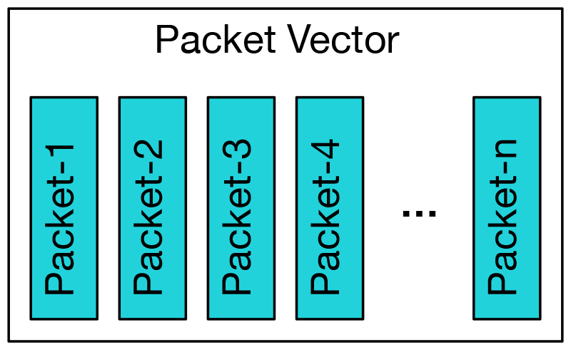
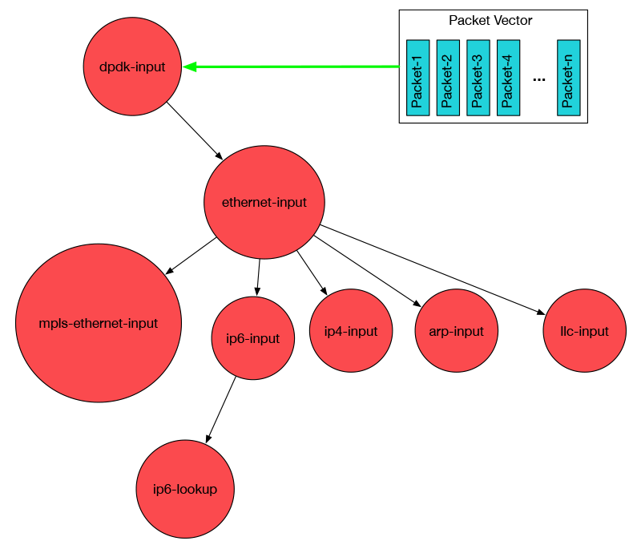

# Vector Packet Processing (VPP)

https://fd.io/technology

## Introduction

In development since 2002, VPP is production code currently running in shipping products. It runs in user space on multiple architectures including x86, ARM, and Power architectures on both x86 servers and embedded devices.  The design of VPP is hardware, kernel, and deployment (bare metal, VM, container) agnostic.  It runs completely in userspace.

VPP helps FD.io push extreme limits of performance and scale. Independent testing shows that, at scale, VPP-powered FD.io is two orders of magnitude faster than currently available technologies.

VPP reads the largest available vector of packets from the network IO layer.

VPP then processes the vector of packets through a Packet Processing graph.

* Fast: VPP instead processes the entire vector of packets through a graph node before moving on to the next graph node.
* Easy extensibility: vpp plugin can rearrange the packet graph and introduce new graph nodes
* Dynamically take advantage of hardware acceleration when available
* High performance low level API, works via a shared memory message bus. This enables vpp integartion with various network controllers

